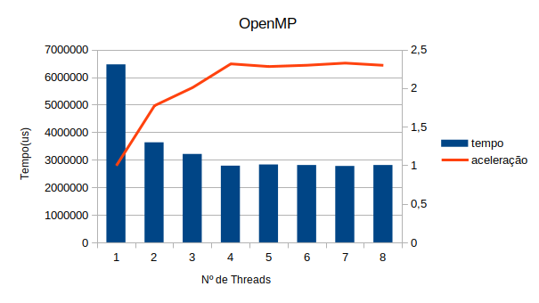

# Pthreads
## 1. Explique como se encontram implementadas as 4 etapas de projeto: particionamento, comunicação, aglomeração, mapeamento (use trechos de código para ilustrar a explicação).
O particionamento ocorre no momento em que as tarefas são subdivididas entre as threads disponíveis, o que ocorre na linha 68 até 70:
```c
for (i = 0; i < nthreads; i++) {
    pthread_create(&threads[i], &attr, dotprod_worker, (void *) i);
}
```

A comunicação, responsável por evitar que o programa entre em condições de corrida, é representada nas linhas 46 a 47:
```c
pthread_mutex_lock (&mutexsum);
dotdata.c += mysum;
pthread_mutex_unlock (&mutexsum);
```

A aglomeração, responsável nesse caso pelo somatório dos valores calculados, está localizado na linha 41:
```c
mysum += (a[i] * b[i]);
```

Por fim, o mapeamento ocorre de forma estática, uma vez que o programa utiliza os argumentos passados no momento da sua chamada e atribui os valores às variáveis correspondentes, o que ocorre nas linhas 83 a 85:
```c
nthreads = atoi(argv[1]); 
wsize = atoi(argv[2]);  // worksize = tamanho do vetor de cada thread
repeat = atoi(argv[3]); // numero de repeticoes dos calculos (para aumentar carga)
```

## 2. Considerando o tempo (em microssegundos) mostrado na saída do programa, qual foi a aceleração (speedup) com o uso de threads?

Considerando os resultados obtidos:

```
./pthreads_dotprod 1 1000000 2000 
10000.000000
1 thread(s), 6978713 usec

./pthreads_dotprod 2 500000 2000  
10000.000000
2 thread(s), 3789415 usec
```
E considerando que a aceleração(speedup) pode ser obtido através da Lei de Amdahl, temos que:
```
6978713/3789415 = 1,8416
```

## 3. A aceleração se sustenta para outros tamanhos de vetores, números de threads e repetições? Para responder a essa questão,você terá que realizar diversas execuções, variando o tamanho do problema (tamanho dos vetores e número de repetições) e o número de threads (1, 2, 4, 8..., dependendo do número de núcleos). Cada caso deve ser executado várias vezes, para depois calcular-se um tempo de processamento médio para cada caso. Atenção aos fatores que podem interferir na confiabilidade da medição: uso compartilhado do computador, tempos muito pequenos, etc.

Para responder a questão, foi implementado o seguinte script:
```bash
#!/bin/bash
echo '~~~~~~ START ~~~~~~'
for i in $(seq 1 10); do threads=1; for i in $(seq 1 8); do ./pthreads_dotprod $threads $((1000000/$threads)) 2000 | grep 'thread'; echo ''; threads=$(($threads+1)); done; done
echo '~~~~~~ END ~~~~~~'
echo ''
```
O script executa o programa pthreads_dotprod com um incremento de 1 thread por execução até 8 threads em 10 iterações, totalizando 80 execuções.

Notou-se que a aceleração se sustentou ao longo dos experimentos, obtendo ganho de desempenho acentuado a partir de 2 threads (1,8x de aceleração)em relação ao caso base até atingir um plateau derca de 2,2x de aceleração com 6, 7 e 8 threads.
## 4. Elabore um gráfico/tabela de aceleração a partir dos dados obtidos no exercício anterior.


A tabela completa pode ser conferida em ```tabela-pthreads.ods```

## 5. Explique as diferenças entre pthreads_dotprod.c e pthreads_dotprod2.c. Com as linhas removidas, o programa está correto?

O programa ```pthreads_dotprod.c``` tem o cuidado de executar as operações de soma com o auxílio de um mutex, o que garante que o resultado da operação será correto, independente da velocidade em que cada thread é executada. O programa ```pthreads_dotprod2.c```, por sua vez, tem as linhas correspondentes ao mutex removidas, o que pode acarretar uma condição de corrida no programa, já que as threads são executadas desordenadamente e podem vir a retornar um output diferente do esperado.
# OpenMP
## 1. Implemente um programa equivalente a pthreads_dotprod.c usando OpenMP.
A implementação está em [openmp/ompnew.c](https://github.com/elc139/t2-gafantinel/blob/master/openmp/ompnew.c).

## 2. Avalie o desempenho do programa em OpenMP, usando os mesmos dados/argumentos do programa com threads POSIX.
Para a execução do programa múltiplas vezes, usou-se o script do programa de pthreads modificado para se adequar ao arquivo ```ompnew```, salvando-se os dados na tabela ```tabela-openmp.ods```.

Foi possível notar que, assim como o programa com threads POSIX, houve um grande ganho na aceleração do programa ao utilizar mais de 1 thread, atingindo-se um plateau de aceleração quando utilizamos 5 threads ou mais. Ainda, notou-se que o programa com OpenMP teve desempenho ligeiramente superior ao programa com POSIX, quando comparados os seus tempos de execução.

Gerou-se, portanto, o seguinte gráfico:



## Referências

https://pt.wikipedia.org/wiki/Lei_de_Amdahl

https://stackoverflow.com/questions/27056090/how-to-parallelize-this-array-sum-using-openmp

https://www.youtube.com/watch?v=1JU931jZP2s

https://docs.microsoft.com/pt-br/cpp/parallel/openmp/reference/openmp-clauses?view=vs-2019#shared-openmp
